# 🏦 나의 지출관리 도우미, IDK 은행

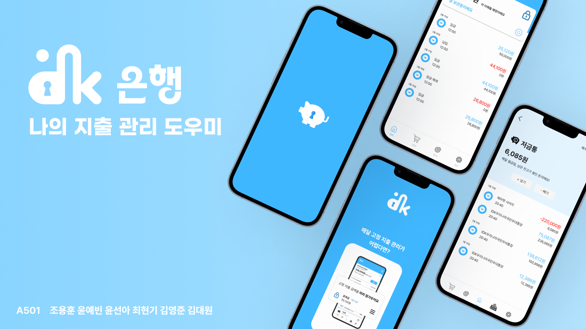

- 한줄 소개 : 고정 지출 자동 관리 서비스
- 서비스 명 : IDK 은행
- 배포 apk : https://drive.google.com/file/d/1Z6WpP71_LZiVNF9-aYQj6VPMxDlaKJQa/view?usp=sharing
- 서비스 개발 기간 : 2024.02.19 - 2023.04.04 (7주)
<br/>
<br/>
<br/>

# 목차

- [대상](https://lab.ssafy.com/s10-fintech-finance-sub2/S10P22A501/-/blob/master/README.md#-%EB%8C%80%EC%83%81)
- [기획배경](https://lab.ssafy.com/s10-fintech-finance-sub2/S10P22A501/-/blob/master/README.md#%EA%B8%B0%ED%9A%8D-%EB%B0%B0%EA%B2%BD)
- [서비스화면](https://lab.ssafy.com/s10-fintech-finance-sub2/S10P22A501/-/blob/master/README.md#-%EC%84%9C%EB%B9%84%EC%8A%A4-%ED%99%94%EB%A9%B4)
- [팀원](https://lab.ssafy.com/s10-fintech-finance-sub2/S10P22A501/-/blob/master/README.md#-%ED%8C%80%EC%9B%90)
- [개발환경](https://lab.ssafy.com/s10-fintech-finance-sub2/S10P22A501/-/blob/master/README.md#%EF%B8%8F-%EA%B0%9C%EB%B0%9C%ED%99%98%EA%B2%BD)
- [주요기능](https://lab.ssafy.com/s10-fintech-finance-sub2/S10P22A501/-/blob/master/README.md#-%EC%A3%BC%EC%9A%94-%EA%B8%B0%EB%8A%A5)
- [페이지 별 기능](https://lab.ssafy.com/s10-fintech-finance-sub2/S10P22A501/-/blob/master/README.md#-%ED%8E%98%EC%9D%B4%EC%A7%80-%EB%B3%84-%EA%B8%B0%EB%8A%A5)
- [기술설명](https://lab.ssafy.com/s10-fintech-finance-sub2/S10P22A501/-/blob/master/README.md#-%EA%B8%B0%EC%88%A0-%EC%84%A4%EB%AA%85)
- [마이데이터 기능](https://lab.ssafy.com/s10-fintech-finance-sub2/S10P22A501/-/blob/master/README.md#-%EB%A7%88%EC%9D%B4%EB%8D%B0%EC%9D%B4%ED%84%B0-%EA%B8%B0%EB%8A%A5)
- [기대효과](https://lab.ssafy.com/s10-fintech-finance-sub2/S10P22A501/-/blob/master/README.md#-%EA%B8%B0%EB%8C%80%ED%9A%A8%EA%B3%BC)
- [프로젝트 진행](https://lab.ssafy.com/s10-fintech-finance-sub2/S10P22A501/-/blob/master/README.md#-%ED%94%84%EB%A1%9C%EC%A0%9D%ED%8A%B8-%EC%A7%84%ED%96%89)
- [협업 방식](https://lab.ssafy.com/s10-fintech-finance-sub2/S10P22A501/-/blob/master/README.md#%EF%B8%8F-%ED%98%91%EC%97%85-%EB%B0%A9%EC%8B%9D)

<br/>
<br/>
<br/>

# 🎯 대상

- **사회인 :** 월급, 용돈 등 고정 수입 관리가 필요한 모든 사회인
- **고정 지출 관리 :** 지출 비율, 상환일, 계좌 잔액을 한눈에 확인하고 싶은 분
- **자제력 부족 :** 계획적인 소비를 원하지만 고정 지출 관리가 어려운 분
- **저축 습관 형성 :** 적금 없이도 꾸준히 저축하고 싶은 분
- **스마트한 돈 관리 :** 꾸준히 돈 관리를 하고 싶지만 귀찮다고 느끼는 분
- **신용카드 사용자 :** 카드 결제 내역을 함께 관리하고 싶은 분
<br/>
<br/>
<br/>

# 👨‍🏫 기획 배경


💵 사회 생활을 시작하면 수입에 따라 매달 적금 등의 자동이체 및 신용카드 대금 등을 포함한 **고정 지출이 발생**합니다.

고정 수입(월급, 용돈 등)이 생기면 고정 지출을 고려하며 소비를 해야하지만, 고정 지출마다 출금되는 날짜가 달라 따로 정리하고 관리하는 일은 번거롭습니다.

이에 따라, 고정수입이 입금될 때 **고정 지출 예산을 자동으로 보관**하여, 목적에 맞게 소비하고 매월 사용 가능 잔고를 한 눈에 확인할 수 있는 서비스를 만들기로 했습니다.

<br/>
<br/>
<br/>

# 📱 서비스 화면

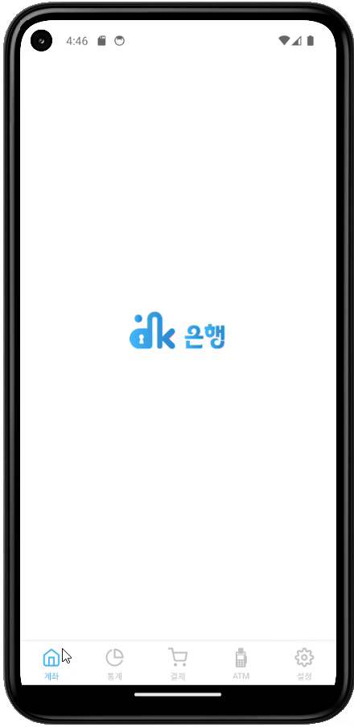


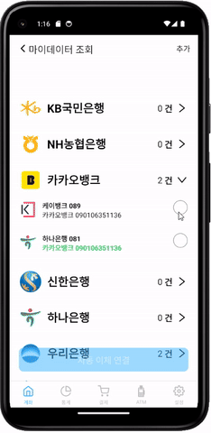

<br/>
<br/>
<br/>

# 👨‍👨‍👧‍👧 **팀원**

| 조용훈(팀장)| 최현기(팀원) |윤선아(팀원)|
| --- | --- |---|
|  |   | |
| BE(돈포켓, 목표저축, 자동이체) | BE (회원, 마이데이터) |BE(입출금, 결제) 인프라 총괄|

| 윤예빈(팀원)| 김대원(팀원) |김영준(팀원)|
| --- | --- |---|
|  |   | |
| FE(계좌, 돈포켓), UI 디자인 총괄 | FE (회원, 마이데이터, 돈포켓) |FE(통계, 결제)|


<br/>
<br/>
<br/>

# ⚙️ 개발환경

- Front
    - `react: 18.2.0`
    - `react-dom: 18.2.0`
    - `react-native: 0.73.6`
    - `expo: 50.0.14`
    - `axios: 1.6.7`
    - `nativewind: 2.0.11`
    - `react-navigation/bottom-tabs: 6.5.18`
    - `react-navigation/native: 6.1.15`
    - `react-navigation/native-stack: 6.9.24`
    - `react-native-async-storage/async-storage: 1.21.0`
- Back-end
    - `JAVA - 17`
    - `Spring Boot - 3.2.3`
    - `Spring Data JPA - 3.2.3`
    - `Spring Security - 6.2.2`
    - `jjwt - 0.12.3`
    - `MySQL - 8.3.0`
    - `Redis - 7.2.4`
    - `DB`
- Infra
    - `Ubuntu - 22.04.3 LTS`
    - `Jenkins - 2.448`
    - `Docker - 25.0.5`
    - `Nginx - 1.18.0`

- 디자인 : [Figma](https://www.figma.com/file/fAisC2pEKzxTOzet9CfqML/README(oh-my-code)?node-id=39%3A1814)


<br/>
<br/>
<br/>

# **👍 주요 기능**
| 구분 | 기능 | 설명 |
| --- | --- | --- |
| 은행 서비스 | 돈 포켓, 고정 지출 관리 기능 | **Don’t Forget / Don Pocket** 매월 고정 수입이 입금될 때 각 고정 지출 예산을 자동으로 관리하는 기능입니다. |
|  | 목표 저축 기능 | 상품 또는 목표 금액에 대해 단기 목표를 설정하여 저축하는 기능입니다. |
|  | 자동 이체 기능 | 주기와 계좌 번호, 금액을 등록하여  자동 이체하는 기능입니다.  |
|  | 저금통 기능 | 매월 고정 수입이 입금될 때 입출금 계좌 잔고를 저금하는 기능입니다. |
|  | 입출금 계좌 기능 | 사용자 입출금 계좌를 통해 입금, 출금, 송금 등을 지원하는 기능입니다. |
| 마이데이터 | 출금 동의 계좌 이체 조회 기능 | 사용자의 타 은행 자동 이체를 조회하는 기능입니다. |
| 통계 | 고정 지출 추이 통계 기능 | 신용카드 대금, 공과금 사용 금액(자금 흐름)을 시각화하여 추이를 확인할 수 있는 기능입니다. |
| 결제 서비스 | 간편 결제 기능 | 계좌의 사용가능 금액을 사용하여 원하는 상품을 간편하게 결제하는 기능입니다. |

<br/>
<br/>
<br/>

# 📱 페이지 별 기능


## 돈포켓 기능
<div>

</div>

- 저금통, 단기 저축, 계좌지정 자동이체, 출금동의 자동이체를 지원합니다.
- 고정 수입 날짜를 기준으로 돈 포켓 입금 여부를 확인하는 인터페이스를 제공합니다.
- 사용자는 각 돈 포켓에 대해 입금 우선순위를 드래그 & 드롭으로 설정할 수 있습니다.
- 고정 수입 입금 시, 설정한 우선순위에 따라 각 돈 포켓에 입금합니다.

## 목표저축 기능


- 구매하고 싶은 상품을 선택하여 가격에 대한 단기 목표를 설정하여 저축할 수 있습니다.
- 단기 목표 금액을 만들기 위해 목표 기간 및 목표 금액을 설정할 수 있습니다.


## 저금통 기능


- 등록한 고정 수입 날짜에 고정 수입이 입금될 때 입출금 계좌 잔고를 저금합니다.
- 사용자는 저금통에 자유롭게 돈을 입금하거나 출금할 수 있습니다.

## 마이데이터 기능


- 사용자는 타 은행의 자동이체 정보를 가져올 수 있습니다.
- 또한, 타 은행의 자동이체와 자동결제에 돈포켓을 연결하여 사용할 수 있습니다.

## 자동이체 기능

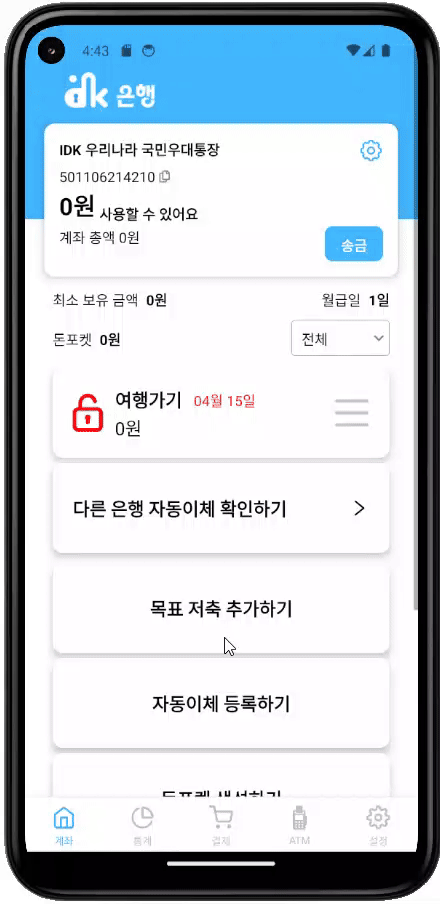
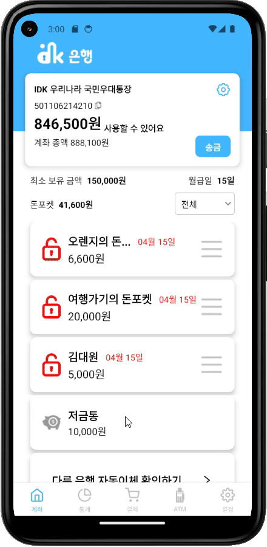

- 이체할 계좌 번호, 금액, 이체 날짜를 등록하여  자동 이체하는 기능입니다.
- 자동이체 생성 후, 돈포켓을 생성할 수 있습니다.
- 자동이체를 해지할 수 있습니다.

## 입출금 계좌 기능
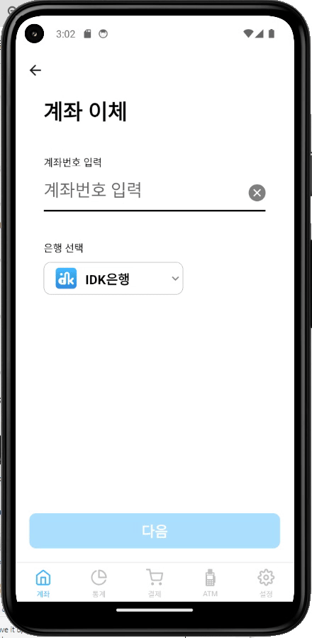

- 입출금 계좌에 대한 잔고를 확인할 수 있습니다.
- 입출금 계좌에 사용자가 입금한 금액만큼 돈을 입금할 수 있습니다.
- 입출금 계좌 잔고 내에서 돈을 출금하거나 송금할 수 있습니다.

## 결제 기능
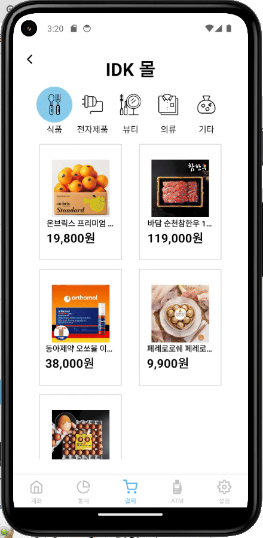

- 원하는 상품을 선택하여 결제할 수 있습니다.
- 계좌에 있는 잔액을 사용하여 결제할 수 있습니다.

## 통계 기능
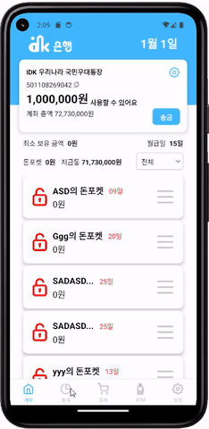

- 최근 1년간 총 지출을 기반으로 사용자의 소비 습관을 파악할 수 있습니다.
- 총 지출, 카드 지출, 공과금, 일반 지출을 카테고리 별로 각 달마다 소비한 금액을 확인할 수 있습니다.
- 각 달의 지출을 카테고리 별로 얼마나 소비하였는지 확인할 수 있습니다.


<br/>
<br/>
<br/>

# 🔨 기술 설명

## 🛡️ 보안
#### 1. 회원가입 
- **문자 본인 인증**을 통해 비인가 사용방지, 중복가입 방지, 주민등록상 본인 여부 확인, 전자상거래의 안전성 보장이 가능합니다.
    
#### 2. 로그인 
- **간편비밀번호 또는 생체인증**(ReactNative)으로 로그인할 수 있습니다.

#### 3. HTTPS + Nginx(DDos)
 - HTTPS는 SSL/TLS 프로토콜을 사용하여 통신을 암호화하므로 공격자가 데이터를 탈취할 수 없습니다.
 - Nginx의 웹 애플리케이션 방화벽 모듈을 활용하여 악성 트래픽과 공격으로부터 웹 애플리케이션을 보호할 수 있습니다.
#### 4.암호화
- 계좌 비밀번호 : 단방향 암호화, SHA-256 알고리즘
- 계좌번호 : 양방향 암호화, RSA 알고리즘 사용
- IDK은행 계좌번호 생성 규칙
    - 총 12자리로 구성
    - 첫 3자리는 은행 식별 번호로 "501"으로 시작
    - 다음 2자리는 계좌 유형을 나타냄 (예: 10은 예금)
    - 다음 6자리는 고객의 계좌 식별 번호, 랜덤생성
    - 마지막 1자리는 검증용 숫자로, 앞 10자리의 계좌번호를 특정 규칙에 따라 검증하는 용도로 사용됨

## 🤵 마이데이터 기능
### 마이데이터 서버 구축 방법
#### 1. 사용자 본인인증 CA 기관 서버 (Certificate Authority)

- 통합인증기관을 통해 사용자가 입력한 이름, 주민등록번호 및 전화번호를 기반으로 각 기관에서 사용자를 식별할 수 있는 CI(Connecting Information)를 생성하여 관리합니다.

#### 2. 정보제공자 기관 서버 (BANK, CARD)

- 사용자의 자동이체 정보 및 신용카드 사용 정보를 확인하기 위해 정보제공자 서버를 구축합니다.

#### 3. 마이데이터사업자 서버 (IDK Bank)

- 정보주체의 금융자산 정보를 활용하여 고정지출 관리 서비스를 제공하는 서버를 구축합니다.

#### 4. 종합포털 서버 (MYDATA)

- 마이데이터사업자, 정보제공자 등 마이데이터 서비스를 제공하기 위해 참여하는 기관을 인증하는 서버를 구축합니다.

### 마이데이터 사전 준비 및 전제

1. 마이데이터 사업자나 정보제공자 등 마이데이터 서비스 이용 희망 기관은 종합포털에서 사업자 증명서 제출 등 적절한 인증 절차를 통해 해당 권한을 획득합니다.
2. 본 서비스에서는 이러한 절차는 미리 이루어진 것으로 가정하고, 각 기관에 client_id, client_secret을 발급해줍니다.

### 마이데이터 인증 로직
1. **통합인증 이용 동의, 전송요구 내역 선택**
    
    정보주체(고객)는 서비스 앱을 통해 통합 인증(본인확인서비스)을 위한 동의서를 확인(동의)하고,
    개인 신용정보 **전송요구 내역을 선택**합니다.
    
    동의 : 각 마이데이터 사업자는 서비스 앱을 통해 고객이 통합인증에 필요한 동의서(본인확인 목적 개인정보 활용 및 제공 등)를확인 및 동의할 수 있도록 화면 구성·제공합니다.
    
    개인신용정보 전송요구 내역 선택 : 마이데이터 사업자는 고객이전송요구 내역을 선택할 수 있도록 화면을 구성·제공합니다.
    
2. **통합인증(자산 연결) 요청**
    
    서비스 앱은 서비스 서버인 IDK 서버로 통합인증 요청합니다.
    
3. **전자서명 요청 및 생성**
    
    서비스 서버는 고객 정보와 전송 요구 목록을 **인증기관**(전자서명 생성 모듈 등)에 보내서 **전자서명**을 **요청**하고, 인증기관은 **전자서명 결과 값**을 생성하여 서비스 서버에 **응답**합니다.
    
4. **통합인증 요청**
    
    IDK서버는 통합인증 요청을 위해, 정보제공자별로 전자서명 결과 값을 전송(API : 통합인증 - 002)합니다.
    
5. **마이데이터 서비스 권한 검증**
    
    정보제공자는 통합인증 요청을 보낸 기관이 마이데이터 사업자 권한이 있는지 확인하기 위해 **종합포털**에 권한 검증 요청을 보내고, 종합포털은 권한 검증 결과를 각 정보제공자에 **응답**합니다.
    
6. **전자서명 검증, 본인확인 요청**
    
    각 정보제공자는 전자서명의 무결성 검증과 고객 본인 확인을 위해 인증기관에 전자서명 검증 요청합니다.
    
7. **본인확인 결과 제공**
    
    인증기관은 본인확인 요청과 전자서명 검증을 처리하고
    결과(CI, 인증서 유효성 등)를 정보제공자에게 제공(7 단계의 응답)합니다.
    
8. **통합인증 결과 제공**
    
    정보제공자는 6, 7 단계 결과를 통해 고객을 인증하고, 
    그 결과로 정보제공 API 요청시 필요한 접근토큰을 마이데이터 서버에게 전송(통합인증-002의 응답)합니다.

### 마이데이터 로직 구조도


## 💰 결제의 동시성
#### Pessimistic Locking (비관적 락)
- 데이터를 읽는 시점에 바로 락을 걸어서 계좌 입출금시 잔액의 동시성 문제를 해결합니다.
#### 결제 시스템
- 결제 요청과 결제 승인으로 나누어 결제 수단의 유효성을 검증하고 임시 주문 정보를 생성하는 과정을 통해 데이터 정합성을 고려한 결제 시스템을 구현했습니다.


<br/>
<br/>
<br/>


# 📈 기대효과

## 1. 고객 기대효과

- **계획적인 소비:** 고정 지출과 저축 목표를 미리 설정하여 계획적인 소비 습관을 형성합니다.
- **편리한 관리:** 자동화된 시스템으로 번거로운 관리 없이 쉽게 목표를 달성합니다.
- **안심하고 소비:** 현재 가용 금액에 대해 정확히 파악하여 고민 없이 소비생활을 즐길 수 있습니다.

## 2. 은행사 기대효과

- **고객 유치:** 주거래 통장을 통한 편리한 서비스 제공으로 고객유치가 가능합니다.
- **예금 유치**: 고정 지출이 출금되는 이체일까지, 고객의 예금을 지속 유치할 수 있습니다.
- **계좌 단일화:** 월급 통장을 분리하지 않고, 하나의 계좌로 계획적인 소비를 할 수 있습니다.
- **예대마진 창출:** 이체일까지 타행 유출 없이 예금을 유치할 수 있습니다.


<br/>
<br/>
<br/>


# 🔍 프로젝트 진행
## Wireframe
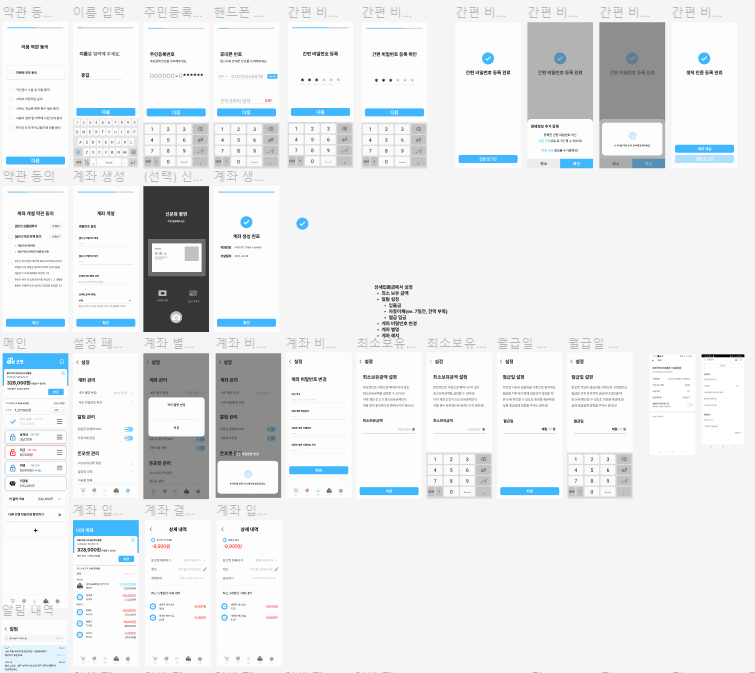


## ERD
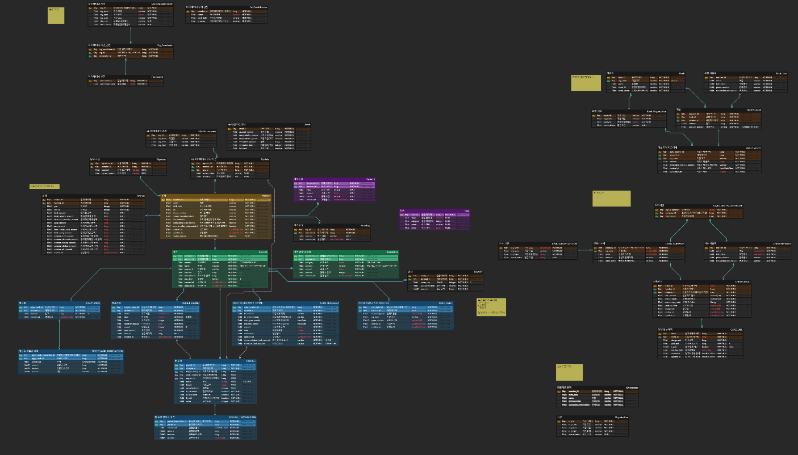

## Logic Flow


## 컴포넌트 설계도
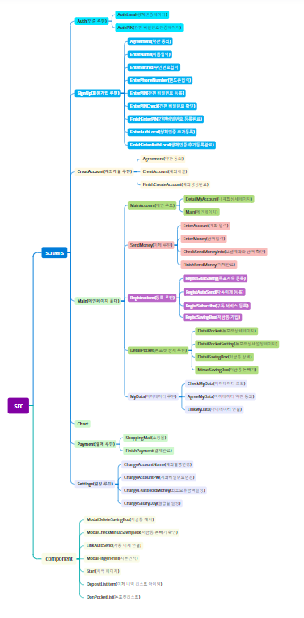

## 아키텍쳐


## 배포
- 서버 :  AWS EC2 Ubuntu 22.04
- apk : 
- CPU: vCPU 4
- Memory: 16GB
- Disk: 320GB SSD
- Traffic: 6TB
## 포트 설정
- Jenkins : 8080 → 8080
- Backend : 8081 → 8080
- MYDATA : 8082 → 8080
- BANK : 8083 → 8080
- CARD : 8084 → 8080
- CA : 8085 → 8080
- MySQL : 3307 → 3306
- Redis : 6379 → 6379

<br/>
<br/>
<br/>

# 🗣️ 협업 방식

- 협업 툴 :  `Gitlab`, `Jira`, `Notion`

## Git
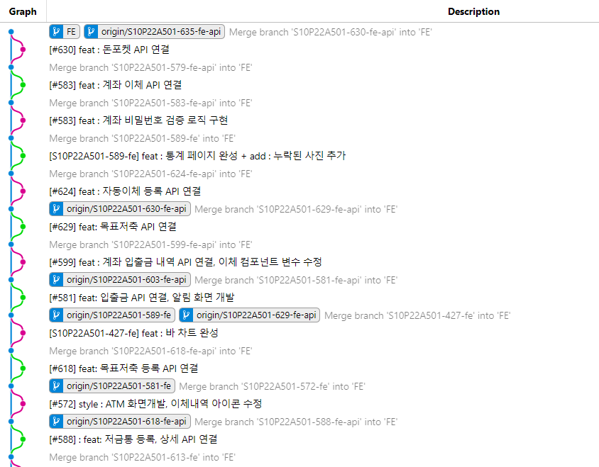
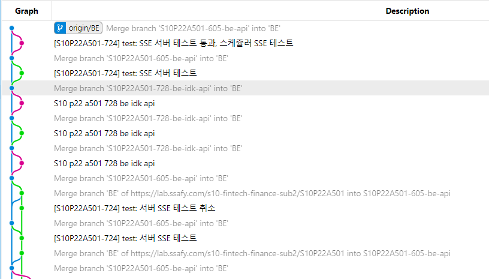


### Commit Message 구조
 기본적으로 커밋 메시지는 아래와 같이 제목 / 본문 / 꼬리말로 구성합니다.

```
커밋 메시지 템플릿

[#Jira Issue Num] type : subject 
ex) [#S10P22A501-123] feat : 저금통 돈 포켓 조회 API 구현
```

### Commit Type

- `add` : 파일, 폴더 추가
- `feat` : 새로운 기능 추가
- `fix` : 버그 수정
- `docs` : 문서의 수정
- `style` : (코드의 수정 없이) 스타일(style)만 변경 (들여쓰기 같은 포맷이나 세미콜론을 빼먹은 경우)
- `refactor` : 코드를 리팩토링
- `test` : Test 관련한 코드의 추가, 수정
- `chore` : (코드의 수정 없이) 설정을 변경
- `remove` : 파일 또는 코드, 리소스 제거
- `resource` : 이미지 리소스, prefab 등의 코드와 상관없는 리소스 추가
- `rename` : 단순 변수명 or 파일명 or 경로명을 바꾼 경우
- `merge` : 브랜치 병합 중 메세지, coflict 해결

### branch 전략

```
master --o--------------------------------o------------------o-------------o
	  \                                \                /             / 1.0
	   \                                \              /             /
	    \                                \  bug fix   /             /
hotfix       \                                o----------o             /
	      \                                                       /
	       \          feat/front/...                             /
release---------o----------o--------o------o----------------o-------o------
		|\        /        / feat/back/...         bug fix   \
		| \      /        /                                   \ ... 
FE     ---------|--o----o        /
		 \	        /
		  \	       /
BE     --------------o----o ... o---
                    \
                     \
feat                  o-------o
											S10P11A504-이슈번호-피드-표시-컨텐츠-결정


```

- `master` : 최종 배포 브랜치
- `hotfix` : 배포 브랜치에서 발생하는 버그를 급하게 수정하는 브랜치
- `release` :
- `FE` : FE 기능 단위 개발 완료 후 `feat` 브랜치에서 붙이는 브랜치
- `BE` : BE 기능 단위 개발 완료 후 `feat` 브랜치에서 붙이는 브랜치
- `feat` : 기능을 개발하기 위한 브랜치. 큰 단위 기능 개발이 완료될 때 `FE` / `BE` 브랜치에 붙임


## Jira
- 프로젝트 일정 관리 및 이슈 추적에 사용하였습니다.
- 금요일마다 다음주에 할 일을 계획하고, 40시간에 맞추어 설정해두었습니다.
- 이슈는 해야할 일, 진행 중, 완료로 나누어 계획이 마무리 되면 실시간 업데이트를 하였습니다.

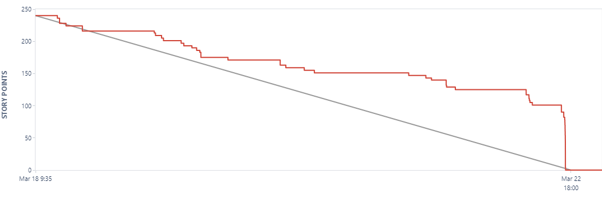


## Notion
- 모두가 공유해야할 자료 및 링크는 노션에 정리했습니다. 
- 각자 공부해온 학습 내용을 공유하고, 명세를 빠르게 업데이트하여 공유하였습니다.

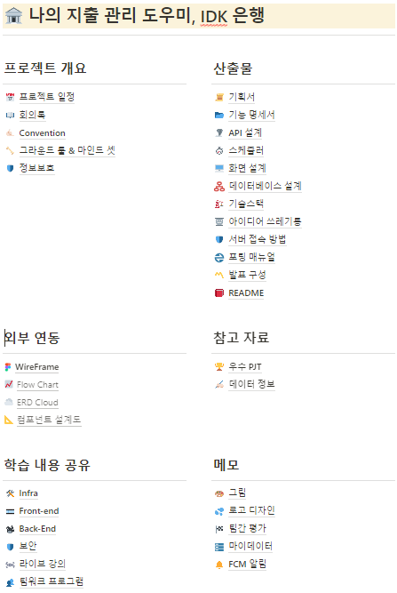


## 스크럼
- 매일 아침과 저녁 스크럼에 계획된 일정을 공유하고, 마친 일정을 공유하여 서로의 스케줄을 확인하였습니다.
- 스크럼을 통해 프로젝트의 진행 상황을 파악하고, 발생한 문제를 공유하며 애자일하게 프로젝트를 진행했습니다.


